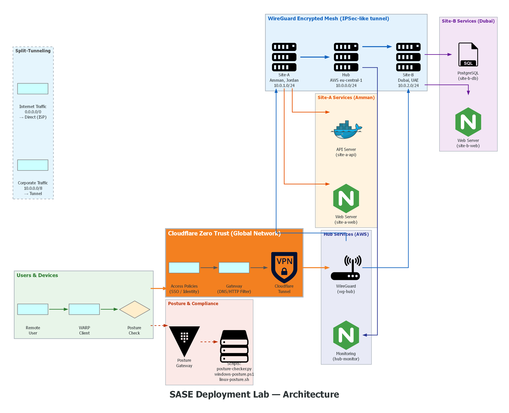

# SASE Deployment Lab

A simulated **Secure Access Service Edge (SASE)** deployment combining **Cloudflare Zero Trust** with **WireGuard** for a multi-site mesh network. Implements identity-based access policies, device posture checks, and split-tunneling across three simulated sites.

## Architecture



*Diagram generated with [Diagrams](https://diagrams.mingrammer.com/) — code in [`scripts/generate-architecture-diagram.py`](scripts/generate-architecture-diagram.py)*

### Data Flow (two independent paths)

| Path | Flow | Purpose |
|------|------|---------|
| **1. Remote Access** | User → WARP → Posture Check → Cloudflare Access → Cloudflare Tunnel → `cloudflared` sidecar → Service | Identity-based app access (Zero Trust) |
| **2. Site-to-Site** | Site-A ← WireGuard → Hub ← WireGuard → Site-B | Encrypted inter-site connectivity |

### Key Distinction
- **Cloudflare Tunnel** provides remote user access to internal apps (replaces traditional VPN)
- **WireGuard Mesh** connects sites to each other (independent of Cloudflare)
- They are **not** chained — a user connecting to Site-A's web server does not pass through the WireGuard mesh

## Features

| Feature | Implementation | Technology |
|---------|---------------|------------|
| **Identity-Based Access** | SSO + email domain policies for internal apps | Cloudflare Access (Terraform) |
| **Device Posture Checks** | Firewall, AV, disk encryption, patch compliance | Python + PowerShell + Bash scripts |
| **Cloudflare Tunnel** | Encrypted tunnel from Cloudflare edge to each site | `cloudflared` sidecar (Docker) |
| **Multi-Site Mesh** | Site-to-site encrypted connectivity (independent of Cloudflare) | WireGuard hub-and-spoke |
| **DNS/HTTP Filtering** | Block malware, phishing, high-risk categories | Cloudflare Gateway |
| **Local Demo Environment** | Simulated 3-site network in containers | Docker Compose |

## Project Structure

```
sase-deployment-lab/
├── terraform/              # Cloudflare Zero Trust as Code
│   ├── main.tf             # Provider setup
│   ├── variables.tf        # Site definitions and configuration
│   ├── access.tf           # Access policies and groups
│   ├── gateway.tf          # DNS/HTTP filtering rules
│   ├── tunnel.tf           # Cloudflare Tunnel + routing
│   └── outputs.tf          # Deployment outputs
├── wireguard/              # Multi-site WireGuard mesh
│   ├── generate-configs.py # Key pair + config generator
│   └── sites/
│       ├── hub/            # Central hub (AWS eu-central-1)
│       ├── site-a/         # Site-A (Amman, Jordan)
│       └── site-b/         # Site-B (Dubai, UAE)
├── posture-checks/         # Device compliance verification
│   ├── posture_checker.py  # Cross-platform checker
│   ├── windows-posture.ps1 # Windows-specific checks
│   └── linux-posture.sh    # Linux-specific checks
├── monitoring/             # Prometheus + Grafana dashboards
│   ├── prometheus.yml
│   ├── grafana-datasources/
│   └── grafana-dashboards/
├── split-tunneling/        # Split-tunnel configurations
│   ├── cloudflare-split-tunnel.json
│   └── wireguard-split-tunnel.conf
├── demo/                   # Demo scenario guides
│   ├── scenario-1-basic-access.md
│   ├── scenario-2-posture-check.md
│   └── scenario-3-split-tunnel.md
├── scripts/                # Deployment automation
│   ├── deploy.sh
│   ├── deploy-vps.sh
│   ├── teardown.sh
│   ├── verify.sh
│   ├── key-exchange.py
│   └── generate-architecture-diagram.py
└── docker-compose.yml      # Local 3-site simulation
```

## Quick Start

### Prerequisites

- [Docker](https://docs.docker.com/get-docker/) + Docker Compose
- [Python](https://www.python.org/downloads/) >= 3.12 (for tests and scripts)
- [Terraform](https://developer.hashicorp.com/terraform/downloads) >= 1.6 (for Cloudflare deployment)
- [Cloudflare API token](https://dash.cloudflare.com/profile/api-tokens) with Zero Trust permissions (for `terraform apply`)
- [Cloudflare WARP](https://developers.cloudflare.com/warp-client/) client (for live posture checks)

### 1. Deploy Local Multi-Site Environment

```bash
# Start the simulated 3-site network
docker compose up -d

# Verify all containers are running
docker compose ps
```

### 2. Configure Cloudflare Zero Trust

```bash
cd terraform

# Create terraform.tfvars
cat > terraform.tfvars <<EOF
cloudflare_api_token = "your-api-token"
zone_id             = "your-zone-id"
domain              = "sase.example.com"
EOF

# Deploy
terraform init
terraform apply -auto-approve
```

### 3. (Optional) Activate Cloudflare Tunnels

Each site has a `cloudflared` sidecar that connects to Cloudflare Zero Trust.
Activate by setting tunnel tokens:

```bash
# After terraform apply outputs tunnel IDs, create tokens:
# Zero Trust > Networks > Tunnels > <tunnel> > Configure > Copy Token
export CF_TUNNEL_TOKEN_SITEA="your-token-here"
export CF_TUNNEL_TOKEN_SITEB="your-token-here"
export CF_TUNNEL_TOKEN_HUB="your-token-here"

# Restart with tunnels active
docker compose up -d
```

### 4. Run Device Posture Checks

```bash
# Cross-platform
python3 posture-checks/posture_checker.py --json

# Windows (as Administrator)
powershell -ExecutionPolicy Bypass -File posture-checks/windows-posture.ps1

# Linux
bash posture-checks/linux-posture.sh
```

### 5. Monitoring Dashboard

```bash
# Start Prometheus + Grafana
make run   # already includes prometheus + grafana

# Expose posture metrics in a separate terminal
make monitor
# → http://localhost:8000/metrics

# Open Grafana
# → http://localhost:3000 (anonymous access enabled)
```

### 6. Quick Tunnel Demo (No Cloudflare Account Needed)

Creates a public URL to your Hub Monitor in 10 seconds:

```bash
make demo-tunnel
# → cloudflared outputs a URL like: https://piece-turtle-crown.trycloudflare.com
# Open that URL in any browser — it tunnels to your local hub-monitor
```

### 7. Test WireGuard Site-to-Site Mesh

```bash
# Apply WireGuard config on the hub
wg-quick up wireguard/sites/hub/wg0.conf

# Verify inter-site connectivity
ping 10.0.1.1  # Site-A from Hub
ping 10.0.2.1  # Site-B from Hub
```

## Demo Scenarios

| Scenario | Description | Time |
|----------|-------------|------|
| **1 - Basic Access** | User authenticates via SSO and accesses internal apps | 10 min |
| **2 - Posture Check** | Non-compliant device is blocked; compliant device passes | 15 min |
| **3 - Quick Tunnel** | Public URL to Hub Monitor via cloudflared (no account needed) | 2 min |
| **4 - Monitoring** | Prometheus metrics + Grafana dashboard for posture data | 5 min |

## Security Considerations

- Replace all placeholder WireGuard keys (`SITE_A_PUBLIC_KEY`, `HUB_PRIVATE_KEY`, etc.) with actual generated keys before production use
- The posture checker does **not** store or transmit any sensitive data — results are printed to stdout
- Terraform state files contain API tokens — add `terraform.tfstate` to `.gitignore` (already configured)
- For production deployments, enable Cloudflare Gateway logs and set up alerting

## Architecture Notes (Honest)

This is a **learning lab**, not a production deployment. Here are the architectural decisions and their implications:

| Design Choice | Why | Limitation |
|---|---|---|
| **Docker bridge for inter-site** | Simple, zero-config — containers ping each other immediately | WireGuard configs are valid but Docker does NOT route through them; actual WireGuard encryption requires real hosts |
| **Two separate path** | Cloudflare = user access, WireGuard = site mesh — they serve different purposes | Adds complexity; production often picks one mesh fabric (Cloudflare or WireGuard), not both |
| **`cloudflared` sidecars** | Demonstrates tunnel connectivity architecture | Requires real Cloudflare tunnel tokens to activate — silent no-op without them |
| **Static posture integration name** | Avoids hardcoding a UUID | The posture integration must be created manually in Cloudflare dashboard first |
| **Gateway policy ≠ split-tunnel** | Clarifies that split-tunneling is a WARP client setting | The `corporate_routing` policy only logs/inspects corp traffic; actual bypass is in WARP config |

**What the Docker simulation proves:** The topology is valid, services deploy and talk to each other, posture checks work cross-platform, and all configuration is Infrastructure as Code. What it doesn't prove is the encrypted tunnel — that requires deploying the WireGuard configs on real hosts or a VM lab (e.g., AWS EC2, DigitalOcean).

## Project Walkthrough (for Interviews)

### Elevator Pitch (30 seconds)

> "I built a simulated SASE deployment that connects three sites — Amman, Dubai, and AWS — into an encrypted mesh using WireGuard, enforces device posture (firewall, AV, disk encryption) before granting access via Cloudflare Zero Trust, and implements split-tunneling so only corporate traffic hits the VPN. The entire deployment is Infrastructure as Code with Terraform and Docker."

### Deep Dive (2-3 minutes)

1. **The Problem**: Organizations with distributed sites struggle with complex VPN meshes and inconsistent security policies. SASE converges networking and security into a cloud-delivered model, but deploying it is non-trivial.

2. **My Approach**: Build a reproducible lab that demonstrates the full SASE stack:
   - **Cloudflare Zero Trust** as the identity/security layer (Access policies, Gateway filtering)
   - **WireGuard** as the encrypted mesh fabric (hub-and-spoke topology)
   - **Device Posture Checks** for zero-trust device compliance
   - **Split-Tunneling** to optimize traffic routing

3. **Key Design Decisions**:
   - WireGuard over IPSec/OpenVPN for simplicity (4k LOC vs 100k+), modern crypto (Noise protocol), kernel integration
   - Terraform for Cloudflare configs — Infrastructure as Code means policies are version-controlled and auditable
   - Multi-platform posture checks (Python + PowerShell + Bash) because real enterprises are heterogeneous
   - Docker Compose for the local simulation — lets anyone reproduce the topology without Cloudflare credits

4. **Trade-offs Made**:
   - Static WireGuard keys vs. a full PKI — acceptable for a lab, but production would use cert-based auth with rotation
   - Simulated Docker networking for inter-site connectivity — the WireGuard mesh configs are real, but the Docker overlay network handles routing locally
   - No persistent state for posture checks (results to stdout only) — intentional for privacy, but production would need a SIEM feed

### What Went Wrong (Failure Story)

The first version of the WireGuard mesh used dynamic routing (BIRD/BGP) on top of WireGuard, which was overly complex for a 3-site topology. Routes kept flapping during key rotation tests. I simplified to a static hub-and-spoke with `AllowedIPs` routing — it's less flexible but rock-solid and the configs are trivially debuggable. This taught me to match complexity to the actual problem, not the coolest technology.

### What I'd Improve Next

- **cert-based WireGuard**: Replace static keys with a CA-signed certificate system with automatic rotation
- **Observability**: Add Prometheus metrics from the posture checker + Grafana dashboard for real-time compliance visibility
- **GitOps CI/CD**: Auto-deploy Terraform on merge to main using GitHub Actions with a sandbox Cloudflare account
- **Threat simulation**: Integrate with Caldera or Atomic Red Team to simulate attacks and verify Gateway policies block them

## Tech Stack

| Technology | Role | Why |
|---|---|---|
| **WireGuard** | Site-to-site encrypted mesh | Minimal attack surface, built into Linux kernel, modern crypto |
| **Cloudflare Zero Trust** | Identity-based access, Gateway DNS/HTTP filtering | Free tier for labs, rich API for Terraform, WARP client for posture |
| **Terraform** | Infrastructure as Code | Cloudflare provider is mature, HCL is declarative, team-friendly |
| **Docker Compose** | Local simulation | Zero-config multi-site topology, containers map to real services |
| **Python** | Posture checker, diagram generator, config generation | Cross-platform, rich stdlib, testable with pytest |
| **GitHub Actions** | CI/CD | Free for public repos, runs tests + Docker build + Terraform validate |

## Demo

Architecture diagram generated with [Diagrams](https://diagrams.mingrammer.com/) — run `make diagram` to regenerate.

## License

MIT
